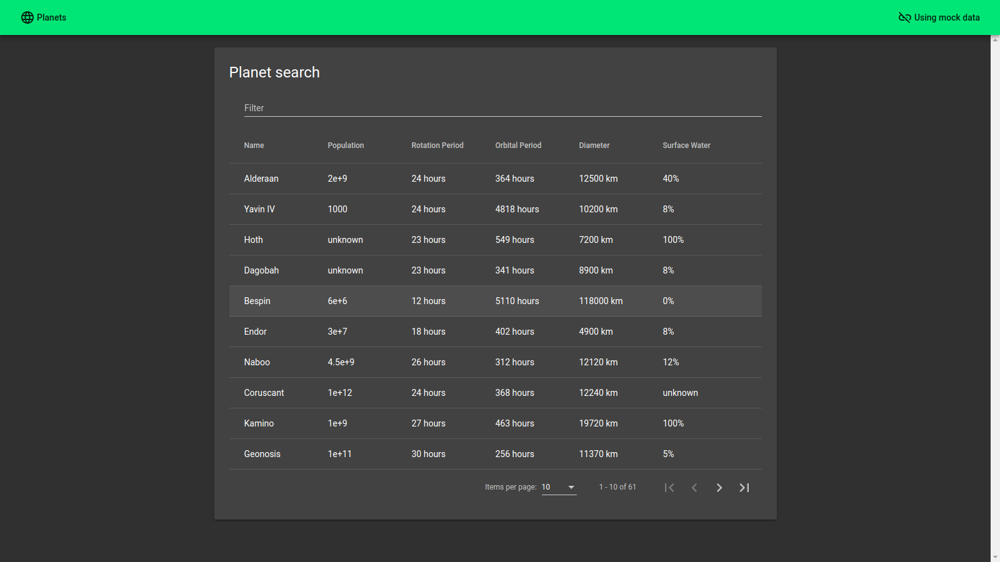

# List of Planets

[App Demo](https://egorgrodno.github.io/list-of-planets/)

An application that presents a list of planets requested from a swapi.co API.

## Development server

Run `$ yarn start` for a dev server. Navigate to `http://localhost:4200/`. The app will automatically reload if you change any of the source files.

## Build

Run `$ yarn build:prod` to build the project. The build artifacts will be stored in the `dist/list-of-planets` directory.
